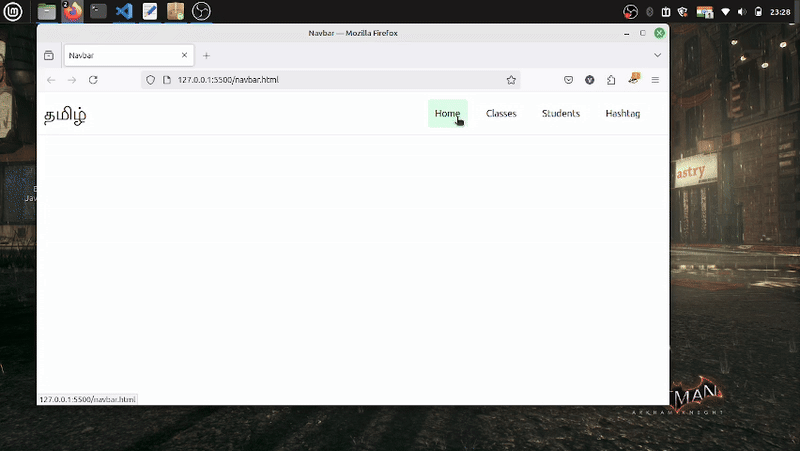

Sample Responsive navbar tailwind css.

Step to make:
  1. Create a seperate divisions for brand logo, bar-icon(hiiden by default) & navbar-icons within a division.
  2. Make that navbar-icon division flex on sm & above breakpoints(small) & change flex-direction from row -> column on small devices.
  3. Make some hover effects on the navbar links & some bg-color for good look.

###Here is the demo of the responsive navbar.

